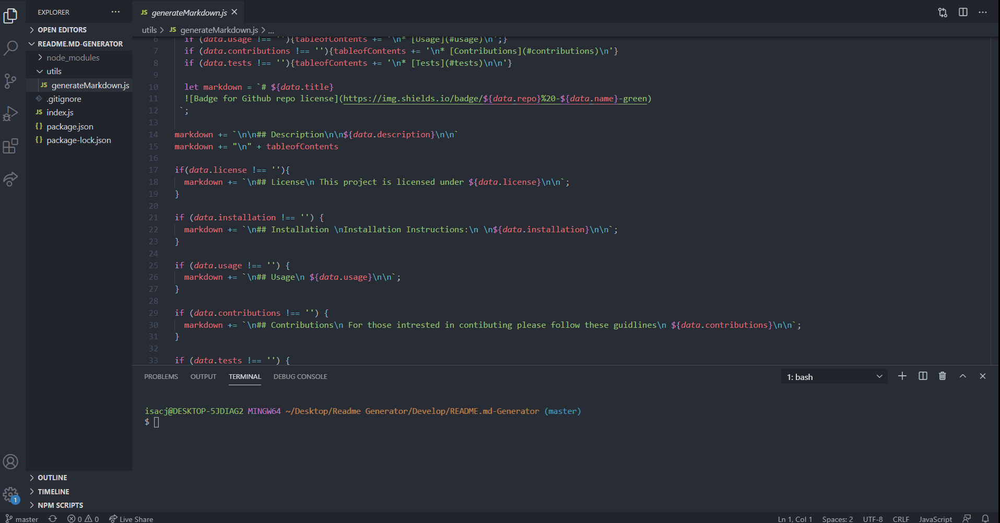
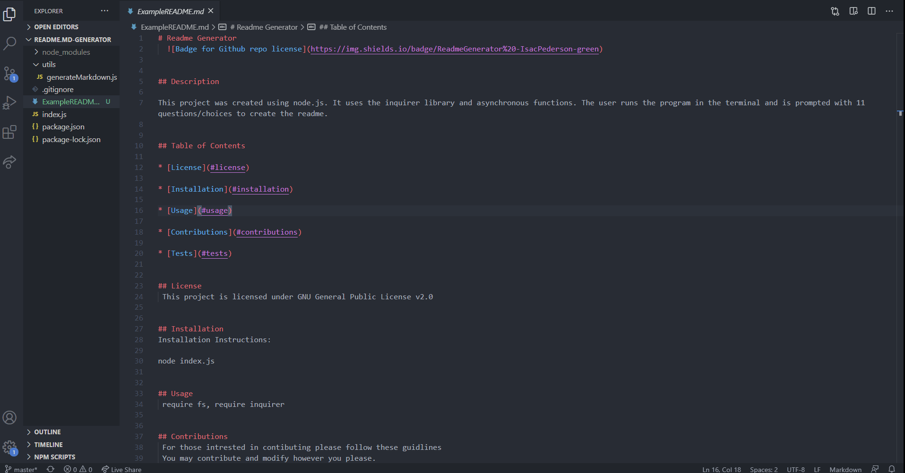

# Readme Generator
  
 

## Description

This project was created using node.js. It uses the inquirer library and asynchronous functions. The user runs the program in the terminal and is prompted with 11 questions/choices to create the readme.

## Table of Contents

* [License](#license)

* [Installation](#installation)

* [Usage](#usage)

* [Contributions](#contributions)

* [Tests](#tests)

## License
 This project is licensed under GNU General Public License v2.0

## Installation 
Installation Instructions:
 
node index.js

## Usage
 require fs, require inquirer

## Contributions
 For those intrested in contibuting please follow these guidlines
 You may contribute and modify however you please.

## Tests
 None

## Questions
 If you have any questions about the repo, open an issue or contact me directly at isacjped@gmail.com. You can find more of my work at (https://github.com/Isac-Pederson/)
 
 

